# DSA 3050A - Business Intelligence & Visualization
## Group Project - Group 6
### Dubai & Abu Dhabi Real Estate Rental Market Intelligence Dashboard

---

## Group Members

| Name | Student ID | Role |
|---|---|---|
| Wilson Jnr Muhia | 669024 | Importation of data, Power Query, data cleaning |
| Hana Gashaw | 670555 | Data Modelling & Star Schema |
| Merhawit Kassa | 670554 | DAX Measures & KPIs |
| Cynthia Gathogo | 668745 | Dashboard & Visualizations |
| Snit Kahsay | 670552 | Business Understanding, GitHub Repository Management & README Documentation |
| Betelhem Kebede | 670549 | Report Writing, Business Insights & Presentation |


## 1. Project Overview

This project develops a comprehensive Business Intelligence dashboard for the UAE real estate rental market using Power BI. The dashboard analyzes property listings across Dubai, Abu Dhabi, Sharjah, Ajman, and other UAE cities, providing actionable insights into rental pricing trends, property type distribution, furnishing preferences, and geographic market performance.

The project was completed in three parts:
- **Part 1:** Power Query — data cleaning and transformation
- **Part 2:** DAX — calculated columns, measures, and time intelligence
- **Part 3:** Data Modelling — star schema dimensional model
- **Part 4:** Dashboard and visualization
 - **Part 4:** Insight and Report
---

## 2. Dataset Information

| Detail | Value |
|---|---|
| **Dataset Name** | Abu Dhabi & Dubai Real Estate Dataset |
| **Source File** | `Abu Dhabi n Dubai real estate data set.xlsx` |
| **Total Rows** | 73,742 property listings |
| **Total Columns** | 17 columns |
| **Date Range** | 2024 (based on Posted Date field) |
| **Coverage** | Dubai (34,250), Abu Dhabi (23,324), Sharjah (9,516), Ajman (4,704), Al Ain (1,040), Ras Al Khaimah (816), Umm Al Quwain (65), Fujairah (27) |

### Original Dataset Columns

| Column | Description |
|---|---|
| Address | Full property address |
| Rent | Annual/monthly rental price |
| Beds | Number of bedrooms |
| Baths | Number of bathrooms |
| Type | Property type (Apartment, Villa, Townhouse, etc.) |
| Area_in_sqft | Property size in square feet |
| Rent_per_sqft | Rent divided by area |
| Rent_category | Categorical rent classification |
| Frequency | Payment frequency (Yearly/Monthly) |
| Furnishing | Furnishing status (Furnished/Semi-Furnished/Unfurnished) |
| Purpose | Listing purpose (For Rent) |
| Posted_date | Date the listing was posted |
| Age_of_listing_in_days | Number of days the listing has been active |
| Location | Specific neighborhood/district |
| City | City (Dubai, Abu Dhabi, Sharjah, etc.) |
| Latitude | Geographic coordinate |
| Longitude | Geographic coordinate |

### Data Quality Notes
- **Missing values:** Latitude and Longitude have 719 null values (approximately 1% of rows) — handled during cleaning; these are only used for map visualizations and do not affect other measures
- **No duplicate full rows** — confirmed via Remove Duplicates in Power Query
- **Inconsistent values:** `villa compound` replaced with `villa with compound` during cleaning

---

## 3. Business Problem

UAE real estate agents, property investors, and market analysts need a centralized, interactive tool to understand the rental market across Dubai, Abu Dhabi, and other emirates. Key business questions include:

- Which locations command the highest average rents?
- How is the market trending — are listings growing month-on-month?
- What proportion of listings are furnished vs. unfurnished?
- Which property types are most in demand by city?
- How does rent per square foot vary across neighborhoods?

---

## 4. Part 1 — Power Query Transformations

All transformations were performed in Power Query before loading data into the Power BI model.

### A. Basic Data Cleaning

| Step | Transformation | Details |
|---|---|---|
| 1 | **Rename Unclear Columns** | Renamed `Age_of_listing_in_days` → `Listing Age (days)`, `Area_in_sqft` → `Area (Sqft)`, and other columns to business-readable names |
| 2 | **Correct Data Types** | Changed `Listing Age (days)` to Duration type; confirmed date columns as Date type; numeric columns as Decimal/Whole Number |
| 3 | **Remove Duplicates** | Applied Remove Duplicates across all columns — no exact duplicates found, confirming data integrity |
| 4 | **Remove Blank Rows** | Removed fully blank rows using Home → Remove Rows → Remove Blank Rows |
| 5 | **Trim & Clean Text** | Applied Trim and Clean to all text fields to remove leading/trailing whitespace and non-printable characters |
| 6 | **Capitalize Each Word** | Applied Capitalize Each Word formatting to text columns (Type, Furnishing, Purpose, Location, City) for consistent display |
| 7 | **Replace Inconsistent Values** | Replaced `villa compound` with `villa with compound` in the Type column to standardize property type labels |
| 8 | **Handle Missing Values** | Latitude and Longitude nulls were left as-is since they are only used for map visuals and do not affect any measures or relationships |
| 9 | **Remove Unnecessary Columns** | Removed columns not required for analysis |

### B. Intermediate Transformations

| Step | Transformation | Details |
|---|---|---|
| 10 | **Split Column** | Split `Posted_date` into separate Year, Month, and Quarter columns for time-based filtering |
| 11 | **Custom Columns** | Created Size Category column (categorizing properties by area) and Luxury Category column (based on rent threshold) |
| 12 | **Conditional Columns** | Built conditional logic columns for property categorization |

### C. Advanced Power Query

| Step | Transformation | Details |
|---|---|---|
| 13 | **Create Date Table** | Built a complete Date Table in Power Query using `List.Dates` to enable Power BI time intelligence functions (YTD, MTD, Previous Month comparisons) |
| 14 | **Reference Query** | Created a Dubai-specific reference query (filtering FactProperty to Dubai records only) to support separate city-level analysis without duplicating the full dataset |
| 15 | **Group By with Multiple Aggregations** | Applied Group By on Location and Property Type columns with multiple simultaneous aggregations: Average Rent (Average), Maximum Rent (Max), Total Listings (Count) — used for executive-level summary tables |
| 16 | **Summarized Table** | Created a summarized table from the reference query providing pre-aggregated data for high-level dashboard performance |

---

## 5. Part 2 — DAX Measures

All 15 DAX measures were created on the `FactProperty` table to support KPI cards, ranking visuals, time-based trends, and conditional formatting across the dashboard.

Screenshots of all measures are in `Screenshots/DAX_Measures/`.

### Basic Aggregation

| # | Measure | DAX Formula | Purpose |
|---|---|---|---|
| 1 | **Total Listings** | `COUNTROWS(FactProperty)` | Counts total number of property listings — used as the primary volume KPI |
| 2 | **Average Rent** | `AVERAGE(FactProperty[Rent])` | Average rent across all listings in current filter context |
| 3 | **Average Area Sqft** | `AVERAGE(FactProperty[Area (Sqft)])` | Average property size — supports rent per sqft analysis |


### Time Intelligence

| # | Measure | DAX Formula | Purpose |
|---|---|---|---|
| 4 | **Listings YTD** | `TOTALYTD(COUNTROWS(FactProperty), DateTable[Date])` | Cumulative listing count from the start of the current year |
| 5 | **Average Rent MTD** | `TOTALMTD(AVERAGE(FactProperty[Rent]), DateTable[Date])` | Average rent month-to-date for current reporting period |
| 6 | **Listings Previous Month** | `CALCULATE(COUNTROWS(FactProperty), PREVIOUSMONTH(DateTable[Date]))` | Total listings from prior month for trend comparison |
| 7 | **Listings Growth %** | `DIVIDE([Total Listings] - [Listings Previous Month], [Listings Previous Month])` | Month-on-month percentage change in listing volume |


### Percentage / Ratio

| # | Measure | DAX Formula | Purpose |
|---|---|---|---|
| 8 | **Avg Rent per Sqft** | `DIVIDE([Average Rent], [Average Area Sqft])` | Normalized price metric for cross-location comparison |
| 9 | **% Furnished Listings** | `DIVIDE(CALCULATE(COUNTROWS(FactProperty), FactProperty[Furnishing] = "Furnished"), [Total Listings])` | Share of listings that are furnished |
| 10 | **% Listings for Rent** | `DIVIDE(CALCULATE(COUNTROWS(FactProperty), FactProperty[Purpose] = "For Rent"), [Total Listings])` | Share of listings with purpose "For Rent" |


### Ranking

| # | Measure | DAX Formula | Purpose |
|---|---|---|---|
| 11 | **Rank by Location Avg Rent** | `RANKX(ALL(DimLocation[Location]), [Average Rent], , DESC, Dense)` | Ranks locations from highest to lowest average rent |
| 12 | **Rank by Property Type Popularity** | `RANKX(ALL(DimPropertyType[Type]), [Total Listings], , DESC, Dense)` | Ranks property types by total number of listings |
| 13 | **Top Location Flag** | `IF([Rank by Location Avg Rent] <= 3, "Top 3", "Other")` | Flags whether a location is in the top 3 by average rent |


### Conditional KPI

| # | Measure | DAX Formula | Purpose |
|---|---|---|---|
| 14 | **Rent Tier** | `IF([Average Rent] >= 200000, "Premium", IF([Average Rent] >= 80000, "Mid-Range", "Budget"))` | Classifies average rent into Premium, Mid-Range, or Budget bands |
| 15 | **Listing Age Status** | `IF(AVERAGE(FactProperty[Listing Age (days)]) <= 30, "Fresh", "Stale")` | Flags listings as Fresh or Stale based on average listing age |


---

## 6. Part 3 — Data Modelling

The data was structured into a **Star Schema** with one central fact table connected to six dimension tables.

### Star Schema Structure

**Fact Table**
- `FactProperty` — contains all quantitative business measures (Rent, Area, Beds, Baths, Listing Age, Latitude, Longitude) and foreign keys linking to each dimension

**Dimension Tables**

| Table | Key Column | Description |
|---|---|---|
| `DateTable` | Date | Full calendar table enabling time intelligence (Year, Month, Quarter) |
| `DimPropertyType` | Type | Property types — Apartment, Villa, Townhouse, Penthouse, etc. |
| `DimPurpose` | Purpose | Listing purpose — For Rent |
| `DimFrequency` | Frequency | Payment frequency — Yearly, Monthly |
| `DimFurnishing` | Furnishing | Furnishing status — Furnished, Semi-Furnished, Unfurnished |
| `DimLocation` | Location | Location name, City, Latitude, Longitude |

### Relationships

All relationships follow Power BI best practices:
- **Cardinality:** One-to-Many (1:*)
- **Cross-filter direction:** Single

| From (One side) | To (Many side) | Join Key |
|---|---|---|
| DateTable | FactProperty | Date / Posted_date |
| DimPropertyType | FactProperty | Type |
| DimPurpose | FactProperty | Purpose |
| DimFrequency | FactProperty | Frequency |
| DimFurnishing | FactProperty | Furnishing |
| DimLocation | FactProperty | Location |

### Data Modelling Screenshots

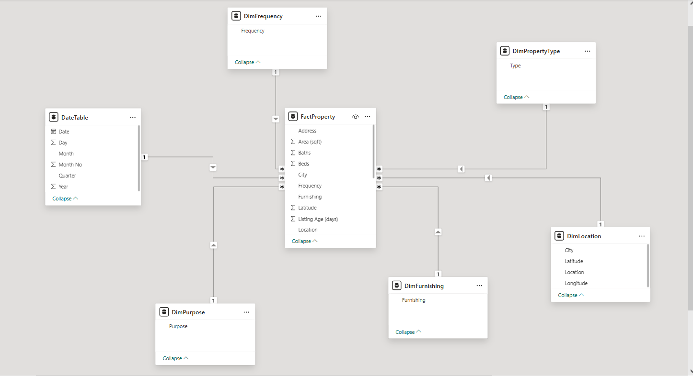

*Figure: Final Star Schema — FactProperty connected to all 6 dimension tables*

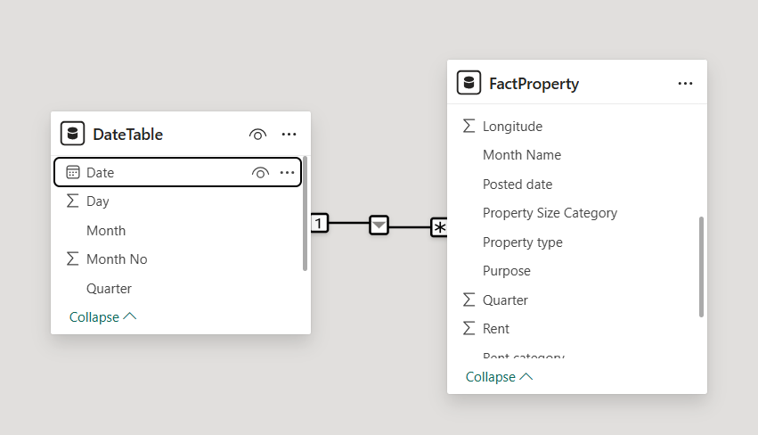
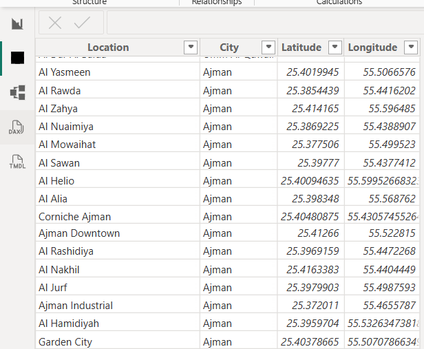
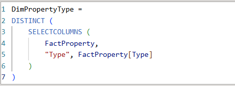
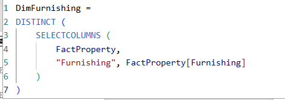
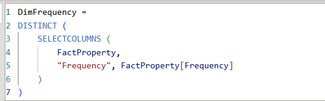
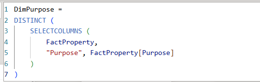

---

## 7. Part 4 — Dashboard Design and Visuals

The dashboard was built as a 5-page Power BI report using a consistent purple executive theme, KPI cards, slicers, and a drill-through page, in line with the advanced visuals required by the project brief.

### Page 1 — Executive Summary

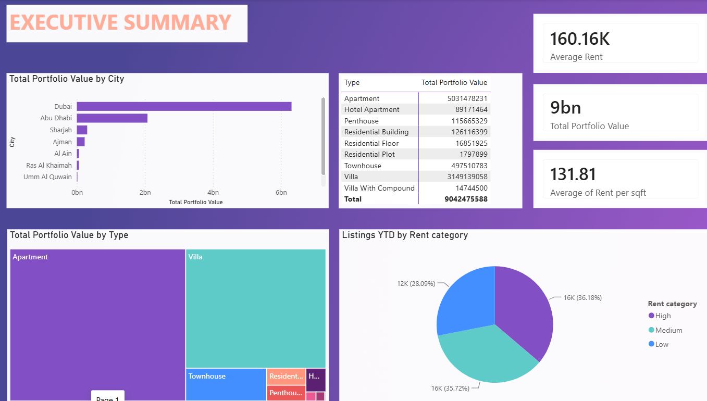

High-level KPI cards (Average Rent, Total Portfolio Value, Average Rent per Sqft) sit alongside a bar chart of Total Portfolio Value by City, a table of portfolio value by property type, a treemap of portfolio value by type, and a pie chart of listings by Rent category.

### Page 2 — Trend Analysis

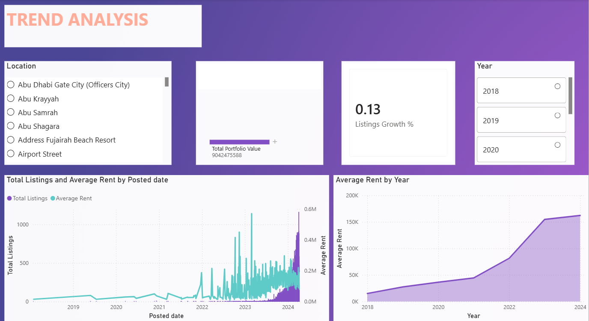

Tracks Total Listings and Average Rent over time by Posted Date, and Average Rent by Year from 2018–2024, with a Listings Growth % KPI card and Location/Year slicers for interactive filtering.

### Page 3 — Geographic & Segment Analysis

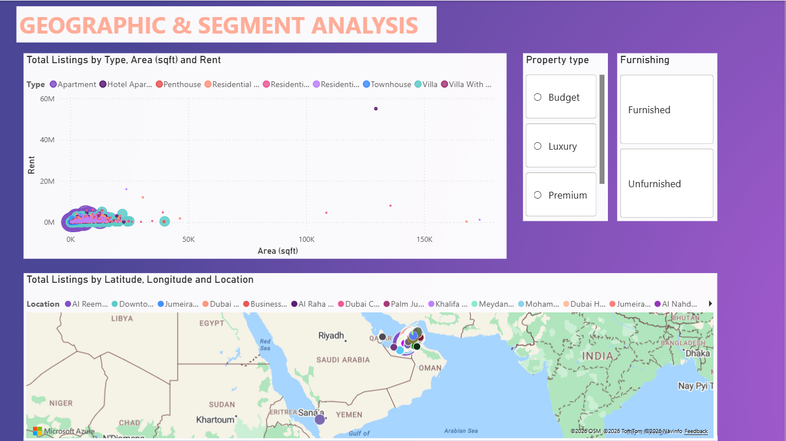

Combines a scatter plot of Total Listings by Type, Area (sqft), and Rent with a map visual plotting listings by Latitude, Longitude, and Location across the UAE, filterable by Property type (Budget/Luxury/Premium) and Furnishing.

### Page 4 — Property Drill-Through Page

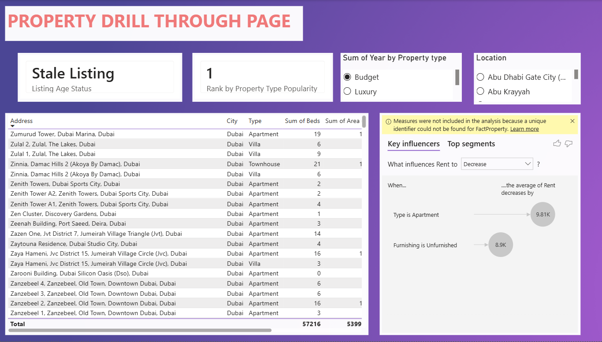

A detailed property-level table (Address, City, Type, Beds, Area) with a Listing Age Status card, a Rank by Property Type Popularity card, and a Key Influencers visual showing what drives Average Rent up or down (e.g. Type = Apartment, Furnishing = Unfurnished).

### Page 5 — Property and Furnishing Insights

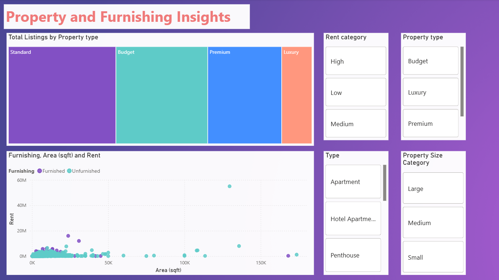

A treemap of Total Listings by Property type (Standard/Budget/Premium/Luxury) alongside a scatter plot of Furnishing, Area (sqft), and Rent, with slicers for Rent category, Property type, Type, and Property Size Category.

---

## 8. Business Insights

**Insight 1 — Dubai dominates listing volume but Abu Dhabi commands higher average rents**
Dubai accounts for 46% of all listings in the dataset, while Abu Dhabi represents 32%. However, several Abu Dhabi locations such as Al Reem Island and Yas Island consistently rank in the top locations by average rent, suggesting a premium market segment in the capital.

**Insight 2 — Unfurnished properties represent the majority of listings**
The majority of listings across both cities are unfurnished, as reflected in the % Furnished Listings measure. This suggests that the rental market is predominantly long-term tenant driven, where renters prefer to furnish their own spaces — an important consideration for property investors targeting furnished short-term rentals.

**Insight 3 — Listing age reveals stale inventory risk**
The Listing Age Status measure flags properties posted more than 30 days ago as Stale. A significant proportion of listings fall into this category, pointing to potential overpricing or mismatched demand in certain property types and locations. Agents can use this insight to proactively adjust pricing strategies.

---

## 9. Repository Structure

```
DSA3050A_GroupProject_Group9/
│
├── Abu Dhabi n Dubai real estate data set.xlsx   ← Source dataset (73,742 rows, 17 columns)
│
├── real estate bi.pbix                           ← Power BI file (all transformations, model, and dashboard)
│
├── documentation.docx                            ← Power Query transformation documentation
│
├── Part3_Report.docx                             ← Data Modelling report (star schema documentation)
│
├── Screenshots/
│   │
│   ├── DAX_Measures/                             ← Screenshots of all 15 DAX measures
│   │   ├── 1.Total Listings.png
│   │   ├── 2.Average Rent.png
│   │   ├── 3.Average Area Sqft.png
│   │   ├── 4,Listings YTD.png
│   │   ├── 5,Average Rent MTD.png
│   │   ├── 6,Listings Previous Month.png
│   │   ├── 7,Listings Growth %.png
│   │   ├── 8,Avg Rent per Sqft.png
│   │   ├── 9.% Furnished Listings.png
│   │   ├── 10.% Listings for Rent.png
│   │   ├── 11.Rank by Location Avg Rent.png
│   │   ├── 12.Rank by Property Type Popularity.png
│   │   ├── 13.Top Location Flag.png
│   │   ├── 14.Rent Tier.png
│   │   └── 15.Listing Age Status.png
│   │
│   ├── Part3DataModelling/                       ← Screenshots of star schema and dimension table creation
│   │   ├── Final_data_model.png
│   │   ├── Date_Table_Connected.png
│   │   ├── DimLocation_Creation.png
│   │   ├── DimPropertyType_Creation.png
│   │   ├── DimFurnishingCreation.png
│   │   ├── DimFrequency_Creation.png
│   │   └── DimPurpose_Creation.png
│   │
│   └── Dashboard_Pages/                          ← Screenshots of all 5 dashboard pages
│       ├── 01_Executive_Summary.png
│       ├── 02_Trend_Analysis.png
│       ├── 03_Geographic_Segment_Analysis.png
│       ├── 04_Property_Drill_Through.png
│       └── 05_Property_Furnishing_Insights.png
│
├── Documentation/
│   ├── Project_Report.docx
│   ├── Data_Dictionary.docx
│   └── Presentation.pptx
│
├── README.md                                     ← This file
└── LICENSE
```

---

## 10. Tools Used

- **Power BI Desktop** — dashboard development, data modelling, DAX measures
- **Power Query Editor** — ETL pipeline (data cleaning, transformation, dimension table creation)
- **DAX** — 15 calculated measures covering aggregation, time intelligence, ranking, and conditional KPIs
- **Star Schema** — dimensional modelling approach (1 fact table + 6 dimension tables)
- **GitHub** — version control and project submission

---

## 11. How to Open the Project

1. Download all files from this repository
2. Open `real estate bi.pbix` in **Power BI Desktop**
3. If prompted about data source, redirect to the local copy of `Abu Dhabi n Dubai real estate data set.xlsx`
4. All Power Query transformations, the star schema model, DAX measures, and dashboard visuals will load automatically
